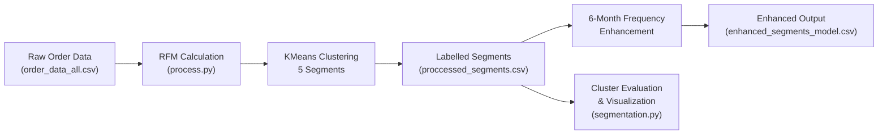
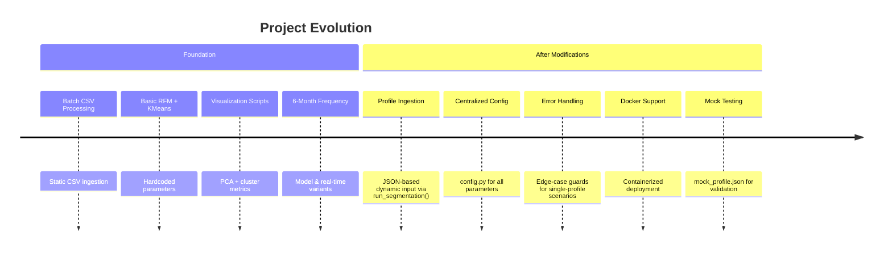

# Customer Segmentation & Analysis — Project Document

## 1. What the Project Does

This project performs **automated customer segmentation** for a retail/distribution business. It analyzes historical order data to classify retailers (customers) into value-based tiers using machine learning, enabling data-driven decisions around marketing, account management, and sales strategy.

### Core Workflow



**In plain terms:** Given a CSV of order transactions, the system:

1. Computes **RFM metrics** (Recency, Frequency, Monetary value) and **Range Sold** (product diversity) for each retailer.
2. Normalizes these features and runs **KMeans clustering** to group retailers into **5 value-based segments**: *Very High*, *High*, *Medium*, *Low*, *Very Low*.
3. Optionally enriches the segmentation with **6-month order frequency** metrics.
4. Evaluates clustering quality and **visualizes segments** via PCA scatter plots and feature-contribution charts.

---

## 2. Foundation / Early Stage Capabilities

In its original form, the project was a **batch-processing, CSV-centric pipeline**:

| Aspect | Foundation Behavior |
|---|---|
| **Data Ingestion** | Read a single, flat CSV file (`data/order_data_all.csv`) with a semicolon delimiter containing ~51 MB of order data across **5,376+ retailers** |
| **Segmentation Logic** | Grouped all orders by `retailer`, computed RFM + Range Sold, applied `StandardScaler` → `KMeans(n_clusters=5)`, and dynamically labelled clusters by average monetary value |
| **Output** | Saved segmented retailers to `data/proccessed_segments.csv` |
| **Visualization** | `segmentation.py` evaluated clustering performance using **Silhouette Score**, **Davies-Bouldin Index**, and **Calinski-Harabasz Index** for k=2 through k=10; rendered PCA 2D scatter plots and feature-contribution bar charts |
| **6-Month Frequency** | Two separate scripts provided frequency enrichment — one model-based (uses latest date in data as reference) and one real-time (uses `datetime.today()`) |
| **Configuration** | Hardcoded values (cluster count, labels, colors, date format) were scattered across multiple scripts |
| **Error Handling** | Minimal — scripts assumed large multi-retailer datasets and would fail or produce misleading results on small or single-retailer inputs |
| **Deployment** | No containerization or API readiness |

### Key Algorithms & Techniques (Unchanged Across Versions)

- **RFM Analysis**: Recency (days since last order), Frequency (number of unique orders), Monetary (total spend), plus Range Sold (unique SKUs purchased)
- **StandardScaler**: Zero-mean, unit-variance normalization before clustering
- **KMeans Clustering**: Unsupervised partitioning into 5 segments with `random_state=42` for reproducibility
- **Dynamic Label Assignment**: Clusters ranked by average monetary value and mapped to labels (Very High → Very Low)
- **PCA (Principal Component Analysis)**: Dimensionality reduction to 2 components for visualization
- **Cluster Evaluation Metrics**: Silhouette Score (cohesion/separation), Davies-Bouldin Index (cluster similarity), Calinski-Harabasz Index (variance ratio)

---

## 3. Modifications & Current Capabilities

### 3.1 Profile-Based Dynamic Ingestion

> [!IMPORTANT]
> This was the most significant architectural change — transitioning from static CSV parsing to accepting structured JSON profiles.

**Before:** `process.py` directly loaded `data/order_data_all.csv` and processed all retailers in bulk.

**After:** `process.py` now exposes a `run_segmentation(profile_data)` function that accepts a single retailer's profile as a JSON dictionary:

```python
def run_segmentation(profile_data):
    """
    Process a single retailer profile for customer segmentation.
    Expects profile_data to be a dictionary matching the defined schema.
    """
```

**Profile schema** (as defined by [mock_profile.json](file:///d:/softwares/davinci/UI_Resource/DVPImages/secret/customer-segmentation-main/mock_profile.json)):

```json
{
    "profile_id": "RETAILER_MOCK",
    "retailer_name": "Mock Retailer A",
    "orders": [
        {
            "orderId": "ORD001",
            "order_date": "01/15/23",
            "sku": "SKU_A",
            "quantity": 2,
            "skuPrice": 10.50
        }
    ]
}
```

This enables **API integration** and **on-demand segmentation** — any external system can call `run_segmentation()` with a JSON payload instead of requiring a pre-built CSV.

---

### 3.2 Centralized Configuration

A dedicated [config.py](file:///d:/softwares/davinci/UI_Resource/DVPImages/secret/customer-segmentation-main/config.py) was introduced to consolidate all tunable parameters:

| Parameter | Value | Purpose |
|---|---|---|
| `NUM_CLUSTERS` | `5` | Number of KMeans clusters |
| `DATE_FORMAT` | `%m/%d/%y` | Date parsing format for order dates |
| `RFM_WEIGHTS` | `{recency: 1.0, frequency: 1.0, monetary: 1.0, range: 1.0}` | Feature weighting (extensible for future use) |
| `LABELS` | `['Very High', 'High', 'Medium', 'Low', 'Very Low']` | Cluster labels |
| `LABEL_COLORS` | Blue/Green/Orange/Red/Purple mapping | Visualization colors |
| `FALLBACK_COLOR` | `#7f7f7f` | Default color for unmapped segments |

Both `process.py` and `segmentation.py` now import from `config.py`, ensuring consistency across the pipeline.

---

### 3.3 Robust Error Handling & Edge-Case Guards

The refactored code includes comprehensive guards for small-data scenarios:

- **`process.py`**: Handles single-retailer profiles gracefully — caps `n_clusters` to the number of available samples via `min(CONFIG['NUM_CLUSTERS'], len(rfm))`
- **`segmentation.py`**: 
  - Exits cleanly if processed segments file is empty or missing
  - Skips PCA and cluster evaluation if only 1 data point is present
  - Caps cluster evaluation range to the number of available samples
  - Wraps scoring functions in try/except for edge cases

---

### 3.4 Docker Containerization

A [Dockerfile](file:///d:/softwares/davinci/UI_Resource/DVPImages/secret/customer-segmentation-main/Dockerfile) was added for deployment:

```dockerfile
FROM python:3.10-slim
WORKDIR /app
COPY requirements.txt .
RUN pip install --no-cache-dir -r requirements.txt
COPY . .
CMD ["python", "process.py"]
```

With a `.dockerignore` that excludes generated data files (except the raw input), Python caches, and IDE configs — keeping the container image lean.

---

### 3.5 Mock Data for Testing

A [mock_profile.json](file:///d:/softwares/davinci/UI_Resource/DVPImages/secret/customer-segmentation-main/mock_profile.json) file was introduced with 5 sample orders across 3 SKUs, enabling:
- Schema validation of the new profile ingestion format
- Standalone testing without the 51 MB production dataset
- CI/CD pipeline integration

---

## 4. File Structure & Responsibilities

| File | Role |
|---|---|
| [process.py](file:///d:/softwares/davinci/UI_Resource/DVPImages/secret/customer-segmentation-main/process.py) | Core segmentation engine — computes RFM, runs KMeans, labels clusters. Exposes `run_segmentation()` for JSON profile input |
| [segmentation.py](file:///d:/softwares/davinci/UI_Resource/DVPImages/secret/customer-segmentation-main/segmentation.py) | Cluster evaluation and PCA visualization. Reads pre-processed segments and generates metric plots + scatter charts |
| [add_6month_frequency_model.py](file:///d:/softwares/davinci/UI_Resource/DVPImages/secret/customer-segmentation-main/add_6month_frequency_model.py) | Enriches segments with 6-month frequency metrics using the latest date in the dataset as reference |
| [add_6month_frequency_real.py](file:///d:/softwares/davinci/UI_Resource/DVPImages/secret/customer-segmentation-main/add_6month_frequency_real.py) | Same enrichment, but uses today's date — suitable for real-time/production analysis |
| [config.py](file:///d:/softwares/davinci/UI_Resource/DVPImages/secret/customer-segmentation-main/config.py) | Centralized configuration for cluster count, labels, colors, date format, and RFM weights |
| [mock_profile.json](file:///d:/softwares/davinci/UI_Resource/DVPImages/secret/customer-segmentation-main/mock_profile.json) | Test fixture with sample profile data for validating the JSON ingestion pipeline |
| `data/order_data_all.csv` | Raw order data (~51 MB, semicolon-delimited) with fields: `retailer`, `orderId`, `order_date`, `sku`, `quantity`, `skuPrice` |
| `data/proccessed_segments.csv` | Output of `process.py` — retailer segments with RFM metrics and cluster labels |
| `data/enhanced_segments_model.csv` | Output of `add_6month_frequency_model.py` — segments enriched with `orders_6m`, `avg_frequency_6m`, `frequency_per_month_6m` |
| [Dockerfile](file:///d:/softwares/davinci/UI_Resource/DVPImages/secret/customer-segmentation-main/Dockerfile) | Container definition for deployment |
| [requirements.txt](file:///d:/softwares/davinci/UI_Resource/DVPImages/secret/customer-segmentation-main/requirements.txt) | Dependencies: `pandas`, `scikit-learn`, `matplotlib`, `numpy` |

---

## 5. Data Scale & Output Summary

- **Input**: ~51 MB of raw order transactions
- **Retailers segmented**: **5,376+** unique retailers
- **Segment distribution** (from `enhanced_segments_model.csv`):
  - **Very High** — Top-tier customers with the highest monetary value
  - **High** — Strong repeat buyers with significant spend
  - **Medium** — Moderate engagement and spend
  - **Low** — Below-average engagement
  - **Very Low** — Minimal activity, potential churn risk
- **Enhanced metrics per retailer**: Recency, Frequency, Monetary, Range Sold, Value Segment, Value Label, Orders in Last 6 Months, Average Frequency (6M), Frequency Per Month (6M)

---

## 6. Summary of Evolution



| Capability | Foundation | After Modifications |
|---|---|---|
| **Data Input** | Static CSV only | JSON profiles via `run_segmentation()` + CSV fallback |
| **Configuration** | Hardcoded across files | Centralized in `config.py` |
| **Single-Profile Handling** | Would crash or produce nonsensical results | Graceful handling with appropriate warnings |
| **Deployment** | Manual script execution | Docker-ready with `Dockerfile` |
| **Testing** | Required 51 MB production dataset | Lightweight `mock_profile.json` for quick validation |
| **API Readiness** | None | `run_segmentation()` function can be wrapped in any web framework |
| **Cluster Evaluation** | Assumed large datasets | Dynamically adapts to dataset size |
